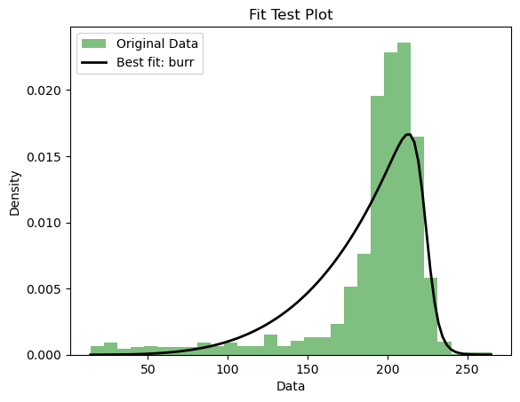

# Modeling production capability using Pandas and Scipy

## Link to Github: https://github.com/gagadzha/modeling-production-capability

## Folder Structure

The project's folder structure is organized as follows:

- **data**: Contains two subdirectories, `daily-production` and `output`, for raw data and output files, respectively.
  - `daily-production`: Contains JSON data for "BRU" and "STO" datasets.
  - `output`: Stores Excel files and test-fit plots.

- **trials**: Contains code snippets and earlier trial notebooks.

- **docs**: Contains the original assignment as markdown-file.

- **final.ipynb**: The final Jupyter Notebook file combining all code snippets and results.

- **production.yml**: Conda Python environment file specifying the project's environment and dependencies.

This organized folder structure helps maintain data organization and separation of code trials, making it easier to manage data analysis and simulation tasks.

## Code for Reading Raw Data

This section defines a function `read_json_data` that reads JSON data from the `data/daily-production` directory. It prompts the user to choose between "BRU" and "STO" datasets or accepts a parameter to read one of them. The data is loaded, cleaned, and converted into a DataFrame. This function allows easy access to production data for analysis.

## Define Useful Functions for Data Handling

This section includes several functions for data cleaning and preparation. Functions like `convert_date` parse date strings, `remove_rows_with_mv` removes rows with missing values, and `clean_data` performs data cleaning, sorting, and conversion for further analysis. These functions help ensure data quality and consistency.

## Write the Results to Excel

The `save_to_excel` function in this section saves the cleaned data to Excel files in the `data/output` directory. It takes the data name ("BRU" or "STO") as input, reads the corresponding JSON data, and then saves the cleaned data as an Excel file with a relevant filename. This function simplifies data export for further analysis.

## Test Data Mean vs Median with and Without Zero Values

This section calculates and compares the mean and median of production data for both "BRU" and "STO" datasets. It provides insights into the central tendency of the data, considering both zero and non-zero values. The results are displayed in a table format, allowing easy comparison.

## Code for Plotting Data

The `plot_data` function plots production data by days of the week for a given dataset ("BRU" or "STO"). It can exclude maintenance-related data if present. This section demonstrates data visualization and helps visualize production trends over different days of the week.

## Code for Fitting Distribution

The `find_best_fit_distribution_continuous` function in this section finds the best-fit probability distribution for the given data using various distribution candidates. It helps identify the most appropriate distribution for modeling the data. The code handles exceptions and provides robust distribution fitting.

## Code for Simulating the Outcomes

The `simulation` function simulates the total production outcome for a specified number of days using a given distribution and parameters. It generates random samples from the distribution and calculates the total production. This section facilitates production prediction and scenario analysis.

## Code for Plotting the Original Data versus the Outcome of the Distribution Fit

The `fit_test_plot` function compares the original production data with the outcome of the best-fit distribution fit. It creates a histogram of the original data and plots the best-fit distribution's probability density function (PDF). This section visually assesses the goodness of fit of the selected distribution.

## Main code 

- **Data Preparation:**
  - Generates sample production data.
  - Cleans data for Brussels (BRU) and Stockholm (STO).

- **Distribution Analysis:**
  - Identifies best-fit distributions for production data, with and without zero values.
  - Specifically tests Normal, Logistic, and Weibull distributions for Stockholm.

- **Visualization:**
  - Plots production data against best-fit distributions to visualize the fit.

- **Production Prediction:**
  - Simulates total production for a 30-day period for both locations.
  - Includes scenarios with standard and normalized (excluding zeros) production.

- **Results Display:**
  - Summarizes best-fit distributions and simulation results in two DataFrames.
  - Clearly displays statistical analysis and production predictions. 

This structured approach combines statistical analysis, data visualization, and predictive modeling to provide comprehensive insights into production data.

The end result should look like this:

For Brussels: 

For Stockholm:

